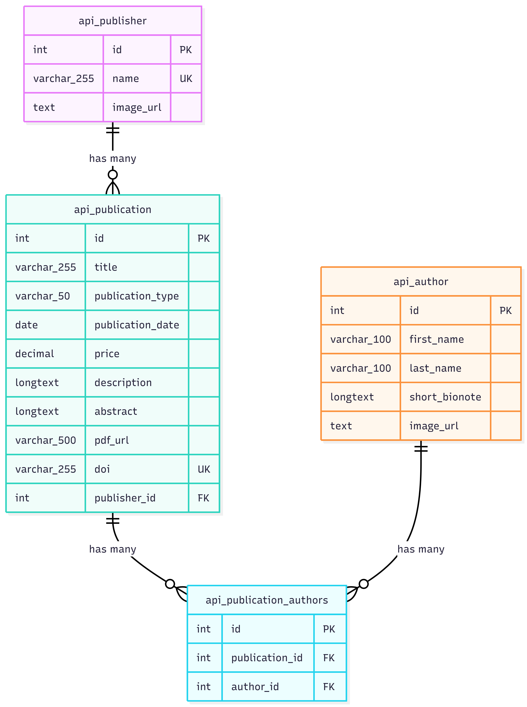

# GRIT Hub Archive

## 💡 Overview

GRIT Hub Archive is a production‑ready, full‑stack web application for managing institutional publications, academic authors, and publishing entities. It solves the problem of decentralized document management by enforcing a **3rd Normal Form (3NF)** relational database structure, providing a robust REST API, and delivering a responsive, modern user interface. The system supports media‑rich profiles, full‑text PDF archiving, persistent identifiers (DOI), role‑based access control, and comprehensive audit logging – all containerised with Docker for **one‑command deployment**.

## 🚀 Key Features

### Major Features

| Feature | Description |
|---------|-------------|
| **Complete CRUD Operations** | Create, read, update, and delete publications, authors, and publishers through an intuitive modal‑based interface. |
| **JWT Authentication & RBAC** | Secure token‑based authentication with two roles: **public** (read‑only) and **admin** (full CRUD). Login required for write operations. |
| **Server‑Side Pagination** | Efficient data loading with user‑selectable page size (5/10/25/50 items per page). |
| **Omni‑Search** | Real‑time, server‑side search across publication titles, abstracts, DOI, author names, and publisher names. |
| **Cloudinary Media Integration** | Upload author avatars, publisher cover images, and full‑text PDFs. All assets are stored securely in the cloud and delivered via CDN. |
| **Persistent Identifiers (DOI)** | Each publication receives a unique DOI, which becomes a clickable link to `doi.org` for permanent citability. |
| **Audit Logging** | Every create, update, and delete operation is automatically logged with the acting user and timestamp. Login events are also logged. |
| **Real Data Import** | A built‑in scraper fetches real academic publications from the Crossref API, populating the database with authentic data. |
| **Dockerised Deployment** | Entire stack (MySQL, Django, React) runs in containers. One command starts everything. |

### Minor Features

- **Real‑time duplicate validation** – prevents duplicate author names, publisher names, and publication titles during form submission.
- **Interactive modals** – all forms and detailed views open in overlays without page reload.
- **Author autocomplete dropdown** – while creating/editing a publication, you can search existing authors or quickly register a new one.
- **Responsive design** – works on desktop, tablet, and mobile (Tailwind CSS).
- **User role display** – the header shows your current role (`admin` or `public`).
- **Dynamic hint text** – the hamburger menu shows “Click menu to reveal utilities” for admins, or “Login to Access Utilities” for public users.
- **Persistent search & pagination** – search query and page size survive tab switches.
- **Automatic token refresh** – the frontend handles expired tokens and prompts for re‑login.
- **Seed script** – generate 200 sample publications, 30 authors, and 8 publishers (if you prefer synthetic data).
- **Environment‑ready** – the repository includes a pre‑configured `.env` file with valid Cloudinary credentials for evaluation.

## 🛠 Tech Stack

| Category      | Technology                                     |
|---------------|------------------------------------------------|
| Frontend      | React 18, Vite, Tailwind CSS, React Hooks     |
| Backend       | Django 5, Django REST Framework, Simple JWT   |
| Database      | MySQL 8.0                                      |
| Media Storage | Cloudinary (images + PDFs)                    |
| Authentication| JWT (signed, role claim included)             |
| Logging       | django‑auditlog + custom login signal         |
| Deployment    | Docker, Docker Compose                        |

## 🏗 Architecture / Data Flow

[Browser] ──► React (Vite) ──► Django REST API ──► MySQL
│ │
└────────── Cloudinary ──────┘ (media uploads)


1. **Frontend (React)** – Consumes the API via `fetch`. Stores JWT tokens in `localStorage`. Conditionally shows UI elements based on user role.
2. **Backend (Django DRF)** – Provides RESTful endpoints for `publications`, `authors`, `publishers`. Uses `ModelViewSet` with custom permissions, pagination, and filtering.
3. **Database (MySQL)** – Normalised 3NF schema (see ERD). Migrations managed by Django.
4. **Media Storage** – Uploads are sent directly to a Django endpoint, which forwards them to Cloudinary using your API keys. Returns a secure URL stored in the database.
5. **Authentication** – Token endpoint (`/api/token/`) returns JWT with a custom `role` claim. Protected endpoints require a valid token.

## ⚡ One‑Command Setup

The simplest way to get the application running with **real data** is to use the provided setup script for your operating system.

### Prerequisites

- Docker Desktop (Windows / macOS) or Docker Engine (Linux)
- Git

### Windows (PowerShell)

```powershell
# 1. Clone the repository
git clone https://github.com/KINGSTING/lumingkit-grit-dev-hiring
cd lumingkit-grit-dev-hiring

# 2. Run the setup script
.\setup.ps1
```
> **If you see an execution policy error**, run `Set-ExecutionPolicy -Scope Process -ExecutionPolicy Bypass` first, then run the script again.

### Linux / macOS (Bash)

```bash
# 1. Clone the repository
git clone https://github.com/KINGSTING/lumingkit-grit-dev-hiring
cd lumingkit-grit-dev-hiring

# 2. Make the setup script executable
chmod +x setup.sh

# 3. Run the one‑command installer
./setup.sh
```

The script will automatically:

- Stop any existing containers and remove the database volume (fresh start)
- Start the containers (MySQL, Django, React)
- Run Django migrations
- Create the admin user (`admin` / `adminpass`)
- Install the required Python dependencies inside the container
- Fetch real academic publications from the Crossref API and populate the database
- Display the frontend URL and login credentials

After the script finishes, open `http://localhost:5173` and log in with:

- **Username:** `admin`
- **Password:** `adminpass`

> **Note:** The repository already includes a `.env` file with pre‑configured Cloudinary credentials for evaluation. If you prefer to use your own Cloudinary account, replace the values in `.env` before running `./setup.sh`.

## 🧪 Alternative Manual Setup (without the script)

If you prefer to run each step manually, follow the instructions below.

```bash
# Start containers
sudo docker compose up -d

# Apply migrations
sudo docker compose exec backend python manage.py migrate

# Create admin user
sudo docker compose exec backend python manage.py shell -c "
from django.contrib.auth.models import User
from api.models import UserProfile
admin, _ = User.objects.get_or_create(username='admin')
admin.set_password('adminpass')
admin.email = 'admin@example.com'
admin.is_staff = True
admin.is_superuser = True
admin.save()
UserProfile.objects.get_or_create(user=admin, defaults={'role': 'admin'})
print('Admin user created')
"

# Run the Crossref scraper to import real data
sudo docker cp scrape_crossref.py grit_django_api:/app/
sudo docker compose exec backend pip install requests
sudo docker compose exec backend python /app/scrape_crossref.py
```

## 📖 Project Documentation

### API Endpoints

| Endpoint                     | Methods               | Description                          |
|------------------------------|-----------------------|--------------------------------------|
| `/api/publications/`         | GET, POST             | List all publications / create new   |
| `/api/publications/{doi}/`   | GET, PUT, DELETE      | Retrieve, update, delete by DOI     |
| `/api/authors/`              | GET, POST             | List all authors / create new        |
| `/api/authors/{id}/`         | GET, PUT, DELETE      | Retrieve, update, delete by ID       |
| `/api/publishers/`           | GET, POST             | List all publishers / create new     |
| `/api/publishers/{id}/`      | GET, PUT, DELETE      | Retrieve, update, delete by ID       |
| `/api/token/`                | POST                  | Obtain JWT (username/password)       |
| `/api/token/refresh/`        | POST                  | Refresh expired token                |
| `/api/upload/`               | POST                  | Upload image/PDF to Cloudinary       |

**Pagination:** `?page=X&page_size=Y` (default 10, max 100)  
**Search:** `?search=term` (titles, authors, publishers, DOI, abstracts)  
**Filtering:** `?publication_type=Book`  
**Ordering:** `?ordering=-publication_date`

### Database Schema (ERD)



The schema is normalised to 3NF with tables: `api_author`, `api_publisher`, `api_publication`, and `api_publication_authors` (junction). A `UserProfile` table extends Django’s `User` with a `role` field (`admin` or `public`).

### Security & RBAC

- JWT tokens include a `role` claim.
- Anonymous users: read‑only.
- Admin users: full CRUD (enforced by backend permissions and frontend UI).

### Audit Logging

All CREATE, UPDATE, DELETE operations on publications, authors, and publishers are logged with user, timestamp, and changes. Login events are also logged via a custom signal.

## 📜 License

This project is distributed under the [MIT License](https://opensource.org/licenses/MIT).

## 📧 Contact

- **Name**: Jemar John J. Lumingkit
- **Project Role**: Lead Developer
- **Email**: [jemarjohn.lumingkit@g.msuiit.edu.ph](mailto:jemarjohn.lumingkit@g.msuiit.edu.ph)